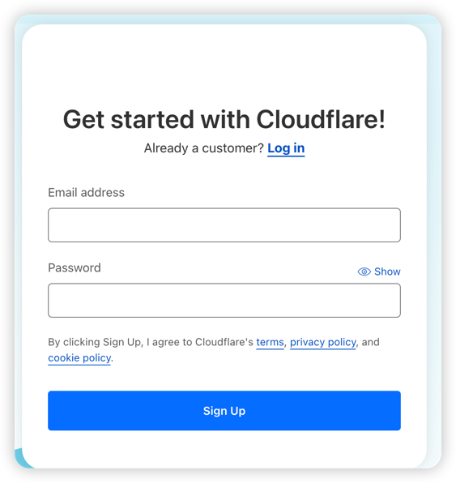
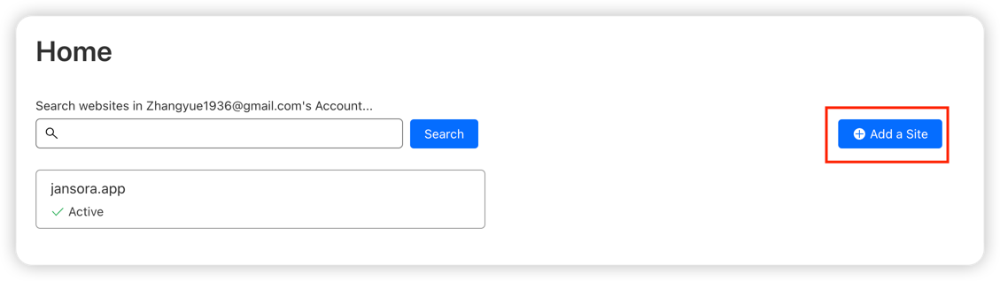
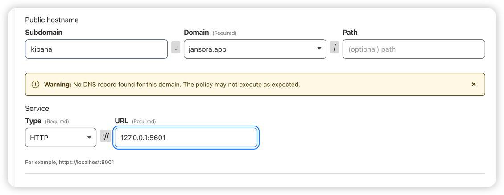
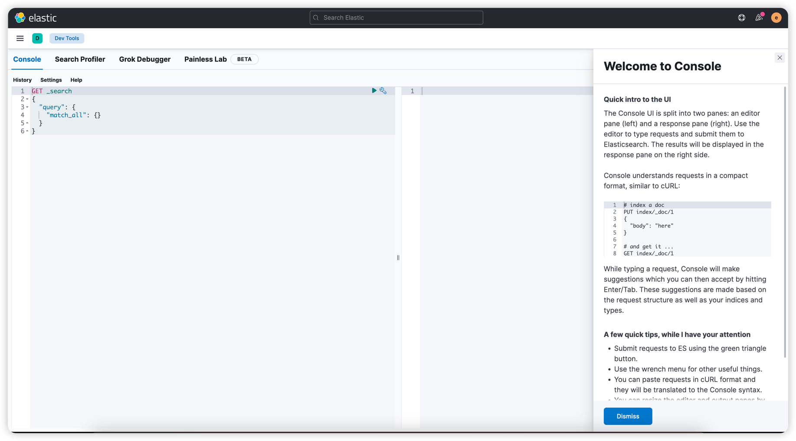

import { Callout } from 'nextra-theme-docs'

# Cloudflare 怎么做内网穿透

Cloudflare 是一个 CDN 和安全服务提供商，不是专门为内网穿透设计的。但是，Cloudflare 提供了一个名为 Argo Tunnel 的功能，可以帮助您实现类似的目标。Argo Tunnel 通过 Cloudflare 的全球网络在您的内网服务器和公共互联网之间创建一个安全的连接。这样，您就可以让外部访问者通过 Cloudflare 访问您的内网服务了。

以下是使用 Cloudflare Argo Tunnel 实现内网穿透的步骤：


## 前提准备
1. 一个域名
2. 一个能联网的电脑
3. 一个信用卡 或 Paypal 账户


## 1. 注册账号
https://dash.cloudflare.com/sign-up




如果已注册, 请登录

https://dash.cloudflare.com/login


登录 Cloudflare


## 2. 申请 Free Plan


<Callout type="warning" emoji="⚠️">
    需要绑定信用卡 或 PayPal
</Callout>

点击 https://one.dash.cloudflare.com/

跟着步骤走 -> 直至申请 Free Plan -> 绑定信用卡 或 PayPal

我个人是通过 PayPal + 美国随便填个地址搞定的

也有人可以通过国内信用卡 + 国内地址解决, 只要能完成 Free Plan 即可

## 3. 绑定域名
<Callout type="warning" emoji="⚠️">
    需要将你原本的 DNS 服务商迁移到 CloudFlare.
    此动作会清除掉你原本的 DNS 记录, 慎用 !!!!!!
</Callout>

点击 https://dash.cloudflare.com/

选择左侧的 Websites 模块


按照步骤走即可.

> 不同的域名提供商更换 DNS 服务商的方法不一样, 具体请咨询 ChatGPT


## 4. 配置 CloudFlare Tunnels

点击 https://one.dash.cloudflare.com/

依次点击 `左侧菜单` -> `Access` -> `Tunnels`

### 4.1 创建 Tunnel:

比如 kibana


### 4.2 安装 Connector

安装提示安装即可

Mac 的安装命令可能如下

```
brew install cloudflare/cloudflare/cloudflared &&

sudo cloudflared service install xxxxxxx
```


### 4.3 配置 Domain




## 大功告成

访问: https://kibana.jansora.app/

登录 `Elastic Search`.



